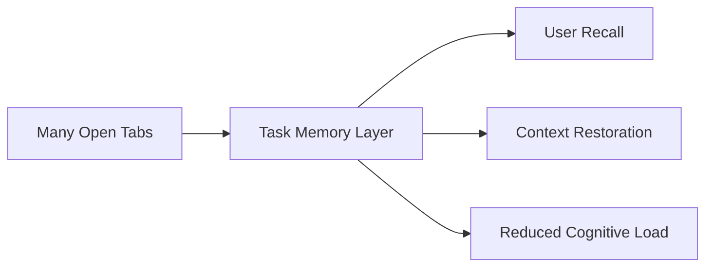
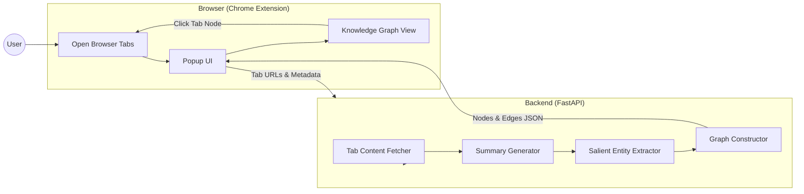
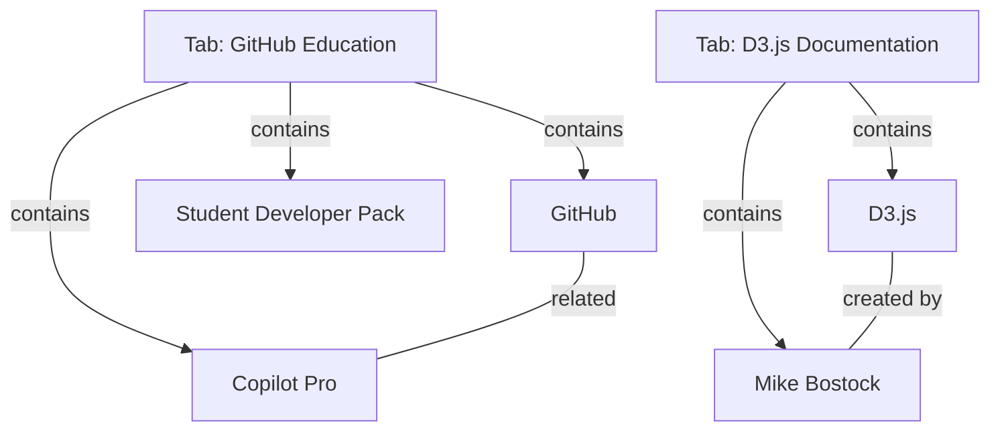
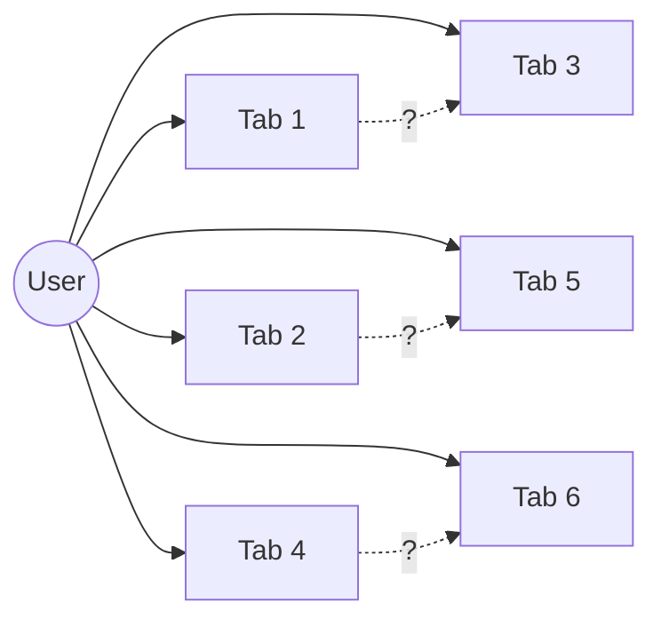
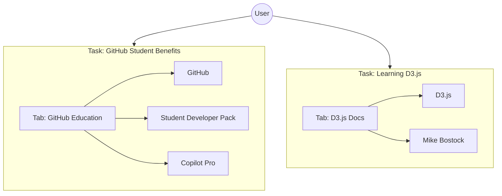

# TabSense 🧠📑

**Semantic Memory for Browser Tabs**

TabSense is a browser-based system that helps users remember **why they opened a tab** and **how different tabs relate to each other**. Instead of treating tabs as isolated pages, TabSense builds semantic summaries and a lightweight knowledge graph over open tabs, enabling users to regain context, reduce cognitive load, and resume tasks more effectively.

---

## 🎯 Motivation

During research, learning, or multi-step workflows, users often open many tabs and later forget:

- The purpose of a tab
- How it connects to other tabs  
- Which tabs belong to the same task

Traditional bookmarks and tab groups do not capture *intent*. TabSense addresses this gap by acting as a **task memory layer** on top of the browser.

---

## ✨ Key Features

### 🔹 Automatic Tab Summaries
Generates concise summaries for open tabs to help users quickly recall the intent behind each tab.

### 🔹 Semantic Knowledge Graph
- Tabs are represented as nodes
- Salient entities (concepts, products, organizations, people) are linked to tabs
- Shared entities naturally connect related tabs

### 🔹 Intent-Focused Design
- Entity extraction is intentionally **pruned**
- Only memory-relevant concepts are retained
- Avoids clutter and information overload

### 🔹 Interactive Visualization
- Hover over nodes to view summaries
- Click a tab node to navigate back to the browser tab
- Drag nodes to explore relationships

---

## 🧠 Design Philosophy

TabSense is not a general-purpose knowledge graph. It is designed as a **Task Memory Graph**.

**Design principles:**
- Fewer but meaningful entities
- Emphasis on *why* a tab exists
- Visual clarity over exhaustive extraction
- Support human memory, not replace it

---

## 🏗️ System Architecture
```
Browser Extension (Frontend)
│
├─ Collects open tabs
├─ Displays summaries
├─ Renders interactive graph (D3.js)
│
Backend (FastAPI)
│
├─ Fetches tab content
├─ Generates summaries
├─ Extracts salient entities
└─ Builds semantic graph
```

---

## 🛠️ Tech Stack

### Frontend
- Chrome Extension (Manifest V3)
- JavaScript (Vanilla)
- D3.js for graph visualization
- HTML / CSS

### Backend
- Python
- FastAPI
- NLP-based summarization and entity extraction

---

## 📊 Data Model

### Nodes

**Tab**
- title
- summary
- url
- tabId
- windowId

**Entity**
- label
- type (concept, product, organization, person, etc.)

### Edges
- `contains` — tab contains an entity
- `semantically_related` — conceptual relationship between entities

---

## 🚀 How to Run

### Backend
```bash
pip install -r requirements.txt
uvicorn main:app --reload
```

### Frontend

1. Open `chrome://extensions`
2. Enable **Developer Mode**
3. Click **Load unpacked**
4. Select the `frontend/` directory

---

## 📌 Current Status

**Implemented:**
- ✅ Tab summaries
- ✅ Semantic graph visualization
- ✅ Interactive exploration
- ✅ Tab navigation from graph

**Planned Enhancements:**
- Task-level clustering
- Session-based grouping
- User relevance feedback
- Cross-session memory

---

## 📐 Architecture Diagrams

### High-Level Concept


### System Architecture


### Semantic Graph Example


### Problem: Tab Confusion


### Solution: Task Memory Graph


---

## 📄 License

MIT License

---
